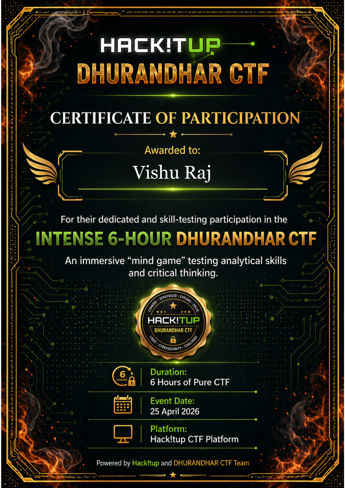

# Hack!tUp CTF - Writeups & Walkthroughs 🚩

This repository contains my participation proof, challenge documentation, and detailed writeups for the **Hack!tUp Capture The Flag (CTF)** event, hosted in April 2026.

## 🏆 Performance Overview
* **Participant:** Vishu Raj
* **Event:** Hack!tUp CTF
* **Format:** Jeopardy-style Cybersecurity Challenge

## 📜 Official Certificate

  

---

## 🧠 Challenge Writeups & Methodology

This section details the practical exploitation techniques and problem-solving methodologies applied during the event. The challenges tested skills across various cybersecurity domains.

### 1. Web Exploitation: Bypassing Access Controls

  

**Objective:** [State the objective of the challenge, e.g., Retrieve the hidden admin flag].
**Vulnerability Identified:** [e.g., Insecure Direct Object Reference (IDOR), Broken Access Control, SQLi].
**Exploitation Steps:**
1. [Explain your initial reconnaissance and how you mapped the target application.]
2. [Detail the specific vulnerability and how you manipulated the request (e.g., using Burp Suite to alter parameters).]
3. [Describe the outcome and how the flag was successfully captured.]

### 2. Network Forensics & Traffic Analysis

  

**Objective:** [State the goal, e.g., Extract credentials from the provided PCAP file].
**Tools Utilized:** [e.g., Wireshark, TShark].
**Analysis Steps:**
1. [Explain how you filtered the network traffic to isolate the relevant packets.]
2. [Describe the process of identifying the unencrypted protocol or extracting the specific payload.]
3. [Detail how the extracted data lead to the flag.]

### 3. Cryptography & Steganography

  

**Objective:** [State the goal, e.g., Decrypt the ciphertext or find the hidden message].
**Analysis Steps:**
1. [Explain how you identified the encryption algorithm or steganography technique used.]
2. [Detail the tools or scripts used to reverse the process.]
3. [Show the final plaintext flag.]

---

## 📸 Additional Challenge Evidence

  
  

  
  

  
  

  
  

  
  

  

---

## 👨‍💻 About the Author
**Vishu_Raj**
A dedicated cybersecurity student and active bug bounty hunter. Currently applying theoretical knowledge to practical scenarios through CTFs and vulnerability assessments.

