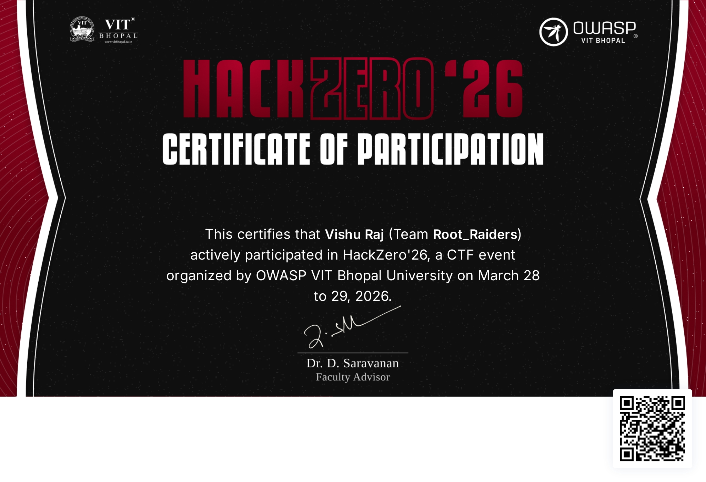

# HackZero '26 CTF - Writeups & Walkthroughs 🚩

This repository documents my methodologies, challenge walkthroughs, and participation proof for the **HackZero '26 Capture The Flag (CTF)** event, hosted by OWASP VIT Bhopal.

## 🏆 Performance Overview
* **Global Rank:** 66th (out of 200+ players)
* **Points Scored:** 2,620 points
* **Event Level:** National-Level Cybersecurity CTF

## 📜 Official Certificate

  

---

## 🧠 Challenge Writeups & Methodology

This section details the practical exploitation techniques applied during the event. Tools utilized during these challenges include Burp Suite, OWASP ZAP, and Gobuster.

### 1. Web Exploitation: Authentication & Access Controls

  

**Objective:** [State what the challenge asked you to do]
**Vulnerability Identified:** [e.g., Insecure Direct Object Reference (IDOR) / Broken Access Control]
**Exploitation Steps:**
1. [Explain how you initially interacted with the target.]
2. [Detail the specific payload or manipulation used, such as altering a user ID parameter.]
3. [Describe how the vulnerability allowed you to bypass restrictions and capture the flag.]

### 2. Injection & Cross-Site Scripting (XSS)

  

**Objective:** [State the goal of the challenge]
**Vulnerability Identified:** [e.g., Stored XSS / SQL Injection]
**Exploitation Steps:**
1. [Explain the enumeration process to find the vulnerable input field.]
2. [Provide the exact payload used to trigger the exploit.]
3. [Detail how the successful execution resulted in retrieving the flag.]

### 3. Traffic Analysis & Cryptography

  

**Objective:** [State the goal of the challenge]
**Exploitation Steps:**
1. [Explain how you analyzed the provided file or cipher.]
2. [Describe the decryption method or forensics technique applied.]
3. [Show the final output that revealed the flag.]

---

## 📸 Additional Challenge Evidence

  
  

  
  

  

---

## 👨‍💻 About the Author
**Vishu_Raj**
A third-year ethical hacking and cybersecurity student, currently applying offensive security skills in a full internship at Codec Technologies. Dedicated to active bug bounty hunting and continuous exploration of the cybersecurity landscape.
