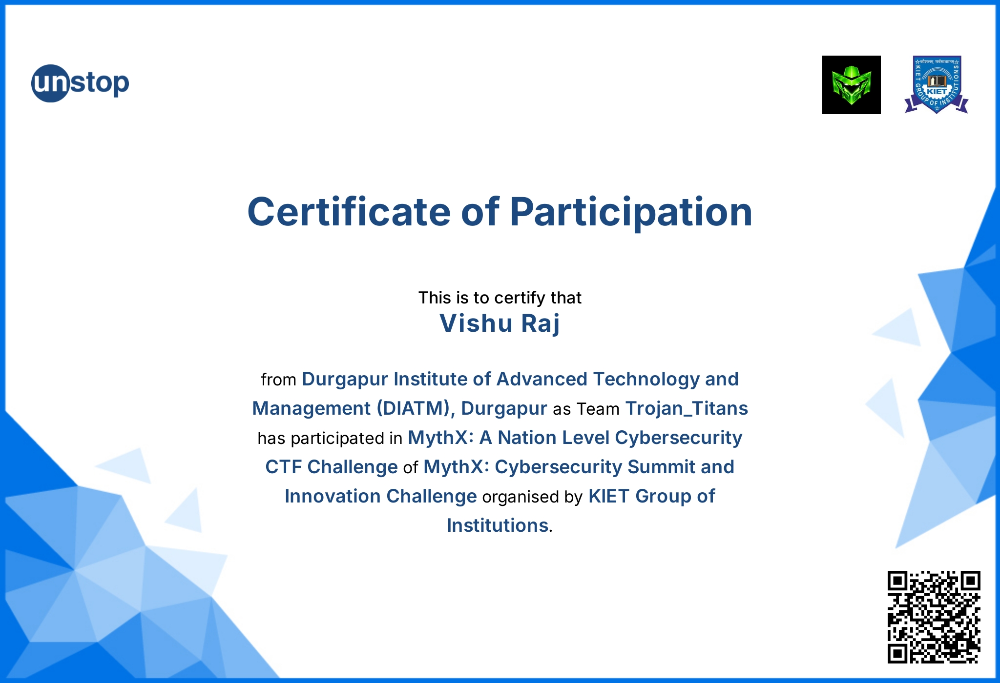

# 🏆 MythX: An Endgame Protocol CTF - Writeups & Methodology

**Author:** Vishu Raj  
**Team:** Trojan_Titans  
**Institution:** Durgapur Institute of Advanced Technology and Management (DIATM)  

Welcome to my technical documentation and vulnerability analysis for **MythX: An Endgame Protocol**, a National-Level Cybersecurity Capture The Flag (CTF) championship hosted by the KIET Group of Institutions. This repository details my approach to exploiting misconfigurations and cryptographic flaws, demonstrating practical applications of offensive security methodologies.

## 🛡️ Event Overview

* **Event:** MythX: Cybersecurity Summit and Innovation Challenge
* **Platform:** CTF7
* **Format:** Jeopardy-Style CTF
* **Date:** March 28 - March 29, 2026
* **Total Players:** 378 | **Total Challenges:** 51

MythX delivered a high-intensity simulation designed to test exploitation, threat analysis, and rapid adaptation under real-world conditions. The challenges spanned multiple cybersecurity domains, mirroring industry-relevant attack vectors.

---

## 💻 Technical Writeups & Exploitation Strategies

### 1. [Web Application Security] Homegrown Authentication System
* **Points:** 300
* **Difficulty:** Medium
* **Author:** Shubham Gabhale
* **Vulnerability Class:** Information Disclosure / Broken Access Control (Insecure Cryptographic Implementation)

#### Threat Context
The challenge featured a custom authentication mechanism for the CTF7 staff portal. Instead of relying on industry-standard JSON Web Tokens (JWTs), the application utilized a proprietary signed cookie system. Guest access was provisioned by default, while the administrative panel was strictly access-controlled.

#### Exploitation Methodology

**Phase 1: Reconnaissance & Traffic Interception**
Adopting a black-box approach, I proxied all web traffic through Burp Suite Professional to map the application's authentication flow. During a routine source code review of the HTTP response from the web root (`/`), I identified a critical Information Disclosure vulnerability. The developers had inadvertently committed a debug comment containing the backend cryptographic signing secret:
``

**Phase 2: Session Token Analysis**
Inspection of the HTTP request headers revealed a Base64-encoded `session_token` cookie. 

**Phase 3: Cryptographic Decoding & Manipulation**
Routing the payload through Burp Suite's Decoder exposed a serialized JSON object managing the user state and a cryptographic signature:
`{"username": "guest", "role": "user", "sig": "502138887ed78468c7e7becd22823500"}`

**Phase 4: Privilege Escalation Execution**
Due to the implementation of a "homegrown" cryptographic signature rather than a robust, standardized JWT protocol—coupled with the leaked `auth_secret`—the session management was completely compromised. 

By elevating the `"role": "user"` parameter to `"role": "admin"`, I utilized the exposed `supersecretkey` to generate a valid cryptographic hash for the new `"sig"` parameter. Injecting this forged administrative session cookie successfully bypassed the access controls, granting full administrative privileges and yielding the flag.

---

### 2. [Cryptography & Digital Forensics] Dead_Signal
* **Vulnerability Class:** Weak Cryptography / C2 Traffic Analysis

#### Threat Context
This challenge required the forensic investigation of a directory named `Dead_Signal`, which housed intercepted network communications. The artifacts included a Command and Control (C2) beacon and a raw hexadecimal memory dump.

#### Exploitation Methodology

**Phase 1: C2 Beacon Triage**
Analysis of the `intercepted` plaintext file uncovered Stage 1 of a C2 beacon, timestamped `2024-04-19 04:00:00 UTC`. The transmission contained a fragmented ciphertext payload:
`ZPDRRNAZNALLYKEAQ`

Preliminary cryptanalysis indicated a standard substitution cipher constraint (e.g., Vigenère or Affine cipher).

**Phase 2: Hexadecimal Payload Extraction**
Further investigation into the `deadrop.hex` artifact revealed a continuous stream of hexadecimal data:
`273126393b313b20352e782f712121320d3961220d39643b102c2e7d66362760332f`

.png)

**Phase 3: Decryption & Flag Compilation**
*(Note: I converted the hex string to ASCII to reveal the secondary beacon payload. By aligning this payload with the decrypted Stage 1 string, the cryptographic key was recovered, successfully yielding the final flag.)*

---

## 🛠️ Tactical Toolkit
* **Burp Suite Professional:** Utilized for HTTP traffic interception, request forging, and payload decoding.
* **Hex Editors:** Employed for low-level analysis of raw data dumps and intercepted beacon streams.
* **Python / Custom Scripts:** Used for rapid cryptographic decoding and string manipulation.
* **Browser Developer Tools:** Leveraged for initial DOM inspection and cookie manipulation.

---

*This documentation reflects my ongoing commitment to offensive security training, mastering vulnerability assessment, and adapting seamlessly to complex, real-world threat vectors.*
